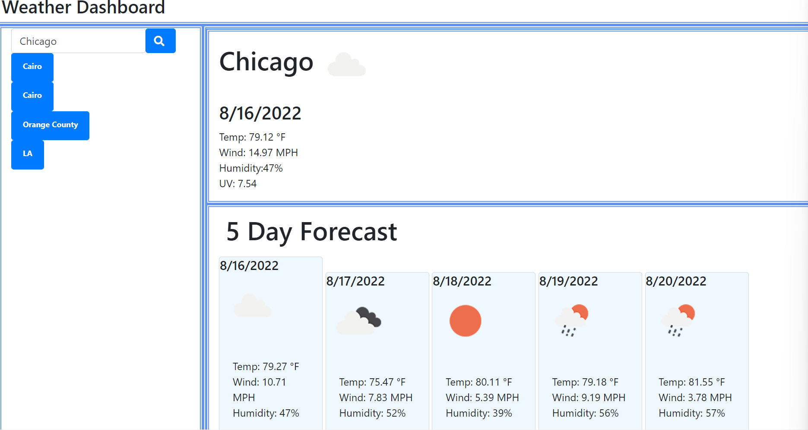

# UCI Coding Bootcamp
## Weather Dashboard

### Decription
Keep track of the current weather and 5 day forecast.

### Installation
Link to the deployed application can be found [here](https://sdanielewicz.github.io/weather_dash "Weather Dashboard").

### Usage
Navigte to the deployed project. In the the search bar type the city you want the current weather and 5 day forecast for. If you refresh the page or come back to it later, you'll find your recent searches were saved and you can click on them to load the weather again.

### Features
* Save recent searches in local storage
* Icons match the forecast
* Local weather includes UV index

### TODO
* fix scoping issues with gloabl var. Possibly store global var as it's own helper function.
* get rid of all those very WET repetitve event listenrs
* style the page more
* fix uneven forecast cards
